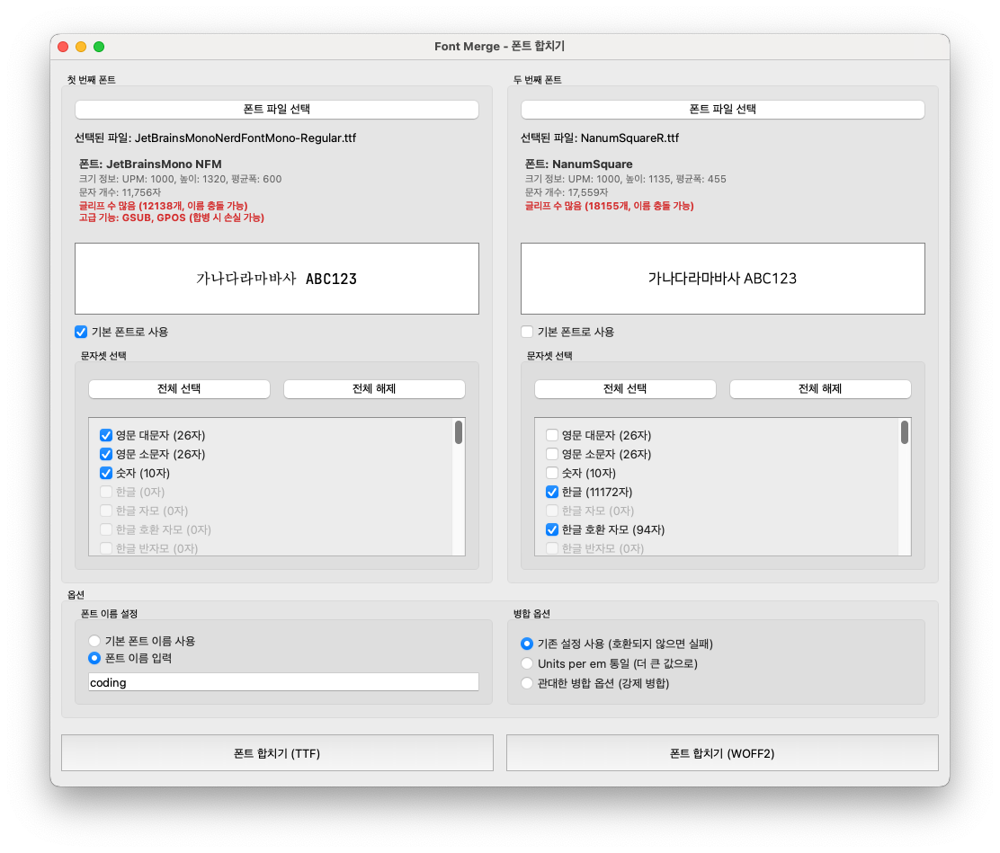

# Font Merge - 폰트 합치기



Font Merge는 두 개의 폰트를 하나로 병합하는 PyQt6 기반 데스크톱 애플리케이션입니다. 직관적인 GUI를 통해 폰트를 선택하고, 각 폰트의 문자 집합을 선택하여 다양한 병합 옵션으로 결합할 수 있습니다.

## 주요 기능

- **폰트 파일 선택**: TTF, OTF 등 다양한 폰트 형식 지원
- **문자 집합 관리**: 영문 대소문자, 숫자, 한글, 특수 기호 등 문자 집합별 선택 가능
- **실시간 미리보기**: 선택한 폰트의 미리보기와 문자 집합 시각화
- **병합 옵션**: 기본 병합, UPM 통일, 관대한 병합 등 다양한 병합 모드
- **사용자 정의 파일명**: 사용자 정의 이름 또는 기본 폰트 이름 기반 파일명 설정

## 설치 및 실행

### 개발 환경

```bash
# 애플리케이션 실행
python -m font_merge.main
# 또는
python main.py

# 코드 포맷팅
ruff format .

# 린팅
ruff check .

# 린팅 이슈 자동 수정
ruff check . --fix
```

### macOS 빌드

```bash
# 앱 번들 빌드
python build_macos.py

# DMG 인스톨러 생성
python create_simple_dmg.py

# 완전한 빌드 및 패키징
python build_and_package.py
```

## 사용 방법

1. **좌측/우측 폰트 선택**: "폰트 파일 선택" 버튼을 클릭하여 병합할 폰트 파일을 선택합니다.
2. **문자 집합 선택**: 각 폰트에서 포함할 문자 집합을 체크박스로 선택합니다.
3. **병합 옵션 설정**: 
   - 기본 설정 사용 (호환되지 않을 실패)
   - Units per em 통일 (더 큰 값으로)
   - 관대한 병합 옵션 (강제 병합)
4. **파일명 설정**: 출력할 폰트 파일의 이름을 설정합니다.
5. **폰트 합치기**: 하단의 "폰트 합치기" 버튼을 클릭하여 병합을 실행합니다.

## 기술 스택

- **GUI 프레임워크**: PyQt6
- **폰트 처리**: fontTools 라이브러리
- **빌드 도구**: PyInstaller
- **코드 품질**: ruff (포맷팅 및 린팅)

## 아키텍처

### 핵심 컴포넌트

- **FontMergeApp**: 메인 애플리케이션 창 및 UI 조정
- **FontSelector**: 폰트 파일 선택 및 문자 집합 관리 위젯
- **FontMerger**: fontTools를 사용한 핵심 폰트 병합 로직
- **FontPreview**: 폰트 미리보기 및 문자 집합 시각화

### 폰트 처리 기능

- 특정 문자 집합 추출을 위한 폰트 서브셋팅
- 설정 가능한 옵션을 통한 폰트 병합
- 문자 집합 분석 및 유니코드 범위 감지
- 합자(ligature) 지원 복원

## 라이선스

이 프로젝트는 오픈 소스입니다.

## 기여하기

버그 리포트, 기능 제안, 풀 리퀘스트를 환영합니다.